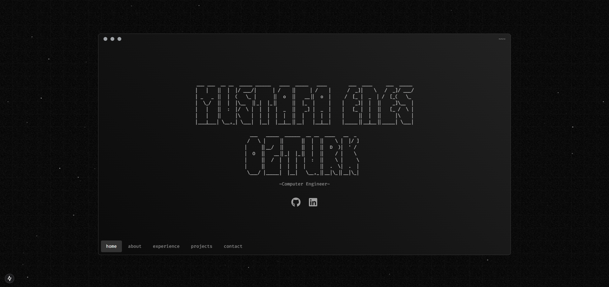
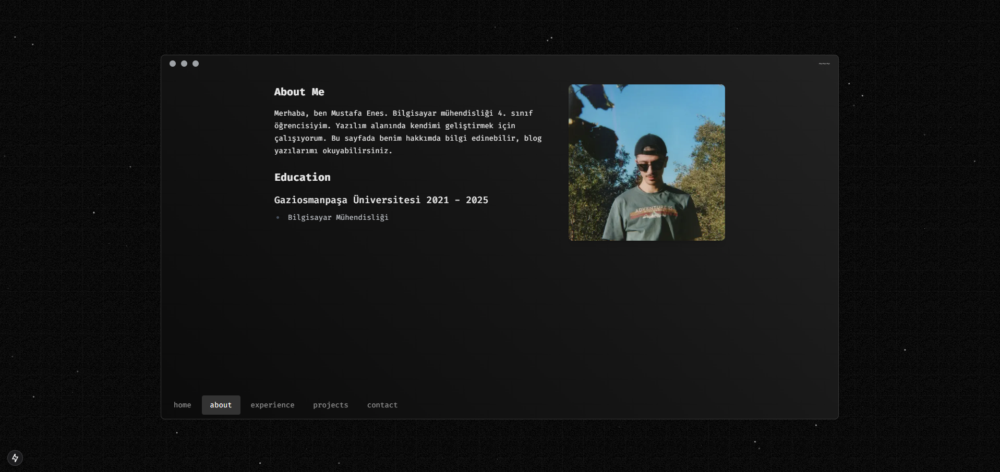
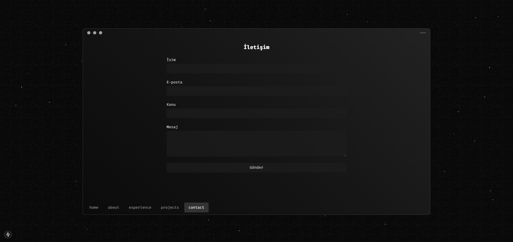
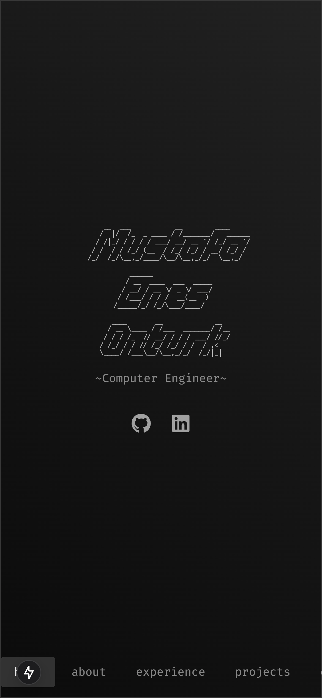

# Terminal Tarzı Portfolyo Websitesi

Bu proje, Next.js ve Tailwind CSS kullanılarak geliştirilmiş, terminal görünümlü modern bir portfolyo websitesidir. Site, profesyonel deneyimlerimi, projelerimi ve yeteneklerimi interaktif bir terminal arayüzü üzerinden sergileyen benzersiz bir tasarıma sahiptir.

## Özellikler

- 🖥️ Terminal tarzı arayüz
- 📱 Tam responsive tasarım
- 🎯 İnteraktif navigasyon
- 📂 Proje vitrini
- 💼 Deneyim zaman çizelgesi
- 🛠️ Yetenekler bölümü
- 📬 İletişim formu
- 📱 Mobil uyumlu görünüm


## Proje Yapısı

```
src/
├── app/
│   ├── about/      # Hakkımda bölümü
│   ├── projects/   # Projeler vitrini
│   ├── experience/ # Profesyonel deneyim
│   └── contact/    # İletişim bilgileri
```

## Kurulum

1. Projeyi klonlayın
2. `.env.example` dosyasını `.env` olarak kopyalayın
3. `.env` dosyasındaki değişkenleri kendi Gmail bilgilerinizle güncelleyin:
   - EMAIL_USER: Gmail adresiniz
   - EMAIL_PASS: Gmail uygulama şifreniz

## Proje Görselleri

### Örnek Sayfalar




### Mobil Görünüm

